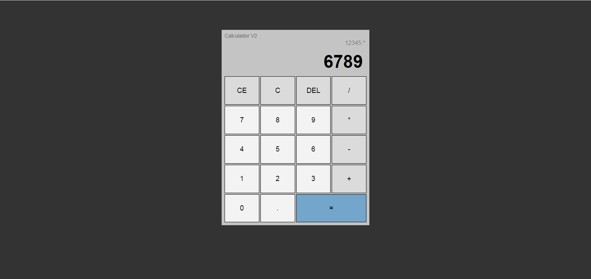

<h1 align="center"> Calculadora </h1>

Programa elaborado através do vídeo do canal Hora de Codar no Youtube, promovido por Matheus Battisti para ensino de tecnologias WEB.  

  <a href="#-tecnologias">Tecnologias</a>&nbsp;&nbsp;&nbsp;|&nbsp;&nbsp;&nbsp;
  <a href="#-projeto">Projeto</a>&nbsp;&nbsp;&nbsp;|&nbsp;&nbsp;&nbsp;

 

  

 

## 🚀 Tecnologias

Esse projeto foi desenvolvido com as seguintes tecnologias:

- HTML e CSS
- JavaScript
- Grid
- Poo
- DOM
- Git e Github

 

## 💻 Projeto

A Calculadora é um programa para operações básicas de uma calculadora, utilizei aprendizagem de programação DOM, Grid, POO entre outras.

 

---

Feito com ♥ by Wellingto Sato 📈 